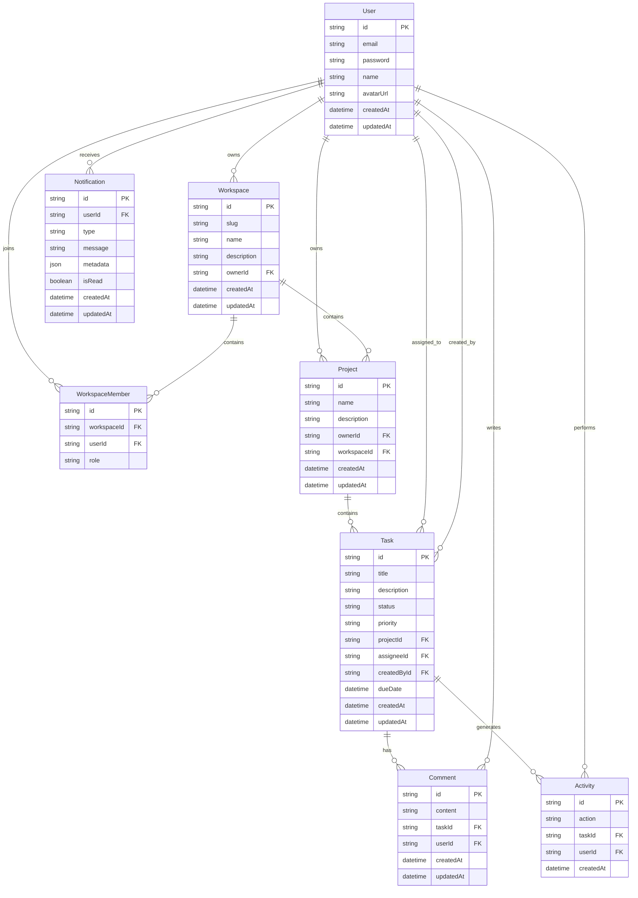

# TaskFlow Backend

TaskFlow is a project management and task tracking system inspired by Jira and Trello.

## Features

- Authentication & Authorization
- Workspace Management
- Project Management
- Task Management
- Comments
- Activity Logs
- Notifications

## Tech Stack

- NestJS
- Prisma ORM
- PostgreSQL
- JWT Authentication
- Swagger
- Docker

## Architecture

Controller
↓
Service
↓
Repository Interface
↓
Repository Implementation
↓
Prisma
↓
PostgreSQL

## Database Design



## Project setup

```bash
$ npm install
```

## Compile and run the project

```bash
# development
$ npm run start

# watch mode
$ npm run start:dev

# production mode
$ npm run start:prod
```

## Run tests

```bash
# unit tests
$ npm run test

# e2e tests
$ npm run test:e2e

# test coverage
$ npm run test:cov
```

## Deployment

When you're ready to deploy your NestJS application to production, there are some key steps you can take to ensure it runs as efficiently as possible. Check out the [deployment documentation](https://docs.nestjs.com/deployment) for more information.

If you are looking for a cloud-based platform to deploy your NestJS application, check out [Mau](https://mau.nestjs.com), our official platform for deploying NestJS applications on AWS. Mau makes deployment straightforward and fast, requiring just a few simple steps:

```bash
$ npm install -g @nestjs/mau
$ mau deploy
```

With Mau, you can deploy your application in just a few clicks, allowing you to focus on building features rather than managing infrastructure.

## License

Nest is [MIT licensed](https://github.com/nestjs/nest/blob/master/LICENSE).
